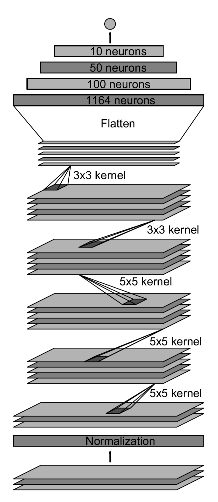

# CarND-Behavioral-Cloning Project: Use Deep Learning to Clone Driving Behavior
At first, I really do not have any clues about what's the deep neural network architecture look alike to handle such a problem. It is a regression problem and not a classification problem. So I asked my mentor about the architecture of the neural network and my mentor recommended me a paper called ["End to End Learning for Self-Driving Cars"](https://images.nvidia.com/content/tegra/automotive/images/2016/solutions/pdf/end-to-end-dl-using-px.pdf) 

So I used their architecture to build the network. Here is what is look alike:

|Layer (type) |                    Output Shape    |      Param# 	|   Connected to|
|-------------|------------------|------------------------------|---------------|
|cropping2d_1 (Cropping2D)       | (None, 80, 320, 3) |   0     |      cropping2d_input_1[0][0]
|lambda_1 (Lambda)             |(None, 40, 160, 3)   | 0     |      cropping2d_1[0][0]
|batchnormalization_1 (BatchNorma |(None, 40, 160, 3)  |  160    |     lambda_1[0][0]
|convolution2d_1 (Convolution2D)  |(None, 40, 160, 24) |  1824   |     batchnormalization_1[0][0]
|maxpooling2d_1 (MaxPooling2D)    |(None, 20, 80, 24)  |  0      |     convolution2d_1[0][0]
|spatialdropout2d_1 (SpatialDropo |(None, 20, 80, 24)  |  0      |     maxpooling2d_1[0][0]
|convolution2d_2 (Convolution2D)  |(None, 20, 80, 36)  |  21636  |     spatialdropout2d_1[0][0]
|maxpooling2d_2 (MaxPooling2D)    |(None, 10, 40, 36)  |  0      |     convolution2d_2[0][0]
|spatialdropout2d_2 (SpatialDropo |(None, 10, 40, 36)  |  0      |     maxpooling2d_2[0][0]
|convolution2d_3 (Convolution2D)  |(None, 10, 40, 48)  |  43248  |     spatialdropout2d_2[0][0]
|maxpooling2d_3 (MaxPooling2D)    |(None, 5, 20, 48)   |  0      |     convolution2d_3[0][0]
|spatialdropout2d_3 (SpatialDropo |(None, 5, 20, 48)   |  0      |     maxpooling2d_3[0][0]
|convolution2d_4 (Convolution2D)  |(None, 5, 20, 64)   |  27712  |     spatialdropout2d_3[0][0]
|maxpooling2d_4 (MaxPooling2D)    |(None, 3, 10, 64)   |  0      |     convolution2d_4[0][0]
|spatialdropout2d_4 (SpatialDropo |(None, 3, 10, 64)   |  0      |     maxpooling2d_4[0][0]
|convolution2d_5 (Convolution2D)  |(None, 3, 10, 64)   |  36928  |     spatialdropout2d_4[0][0]
|maxpooling2d_5 (MaxPooling2D)    |(None, 2, 5, 64)    |  0      |     convolution2d_5[0][0]
|spatialdropout2d_5 (SpatialDropo |(None, 2, 5, 64)    |  0      |     maxpooling2d_5[0][0]
|flatten_1 (Flatten)              |(None, 640)         |  0      |     spatialdropout2d_5[0][0]
|dense_1 (Dense)                  |(None, 100)         |  64100  |     flatten_1[0][0]
|dense_2 (Dense)                  |(None, 50)          |  5050   |     dense_1[0][0]
|dense_3 (Dense)                  |(None, 10)          |  510    |     dense_2[0][0]
|dense_4 (Dense)                  |(None, 1)           |  11     |     dense_3[0][0]
Total params: 201,179
Trainable params: 201,099
Non-trainable params: 80
____________________________________________________________________________________________________

I have used the [Sample Training Data](https://d17h27t6h515a5.cloudfront.net/topher/2016/December/584f6edd_data/data.zip) from Udacity to train the model.

I have tried lots of learning rates like 0.1, 0.01, 0.001, 0.0001, 0.00001 and so on. I found the learning rate 0.0003 is the best for the model because the driving behavior is the best I have seen. However, when I tried to run the model on the simulator, it cannot last for a lap. The car will run out of the road eventually. 

#####I have tried so many times to adjust the learning rate. I can not make meet the specifications that "No tire may leave the drivable portion of the track surface", Could you give me some suggestions to guide me to meet this specification?

